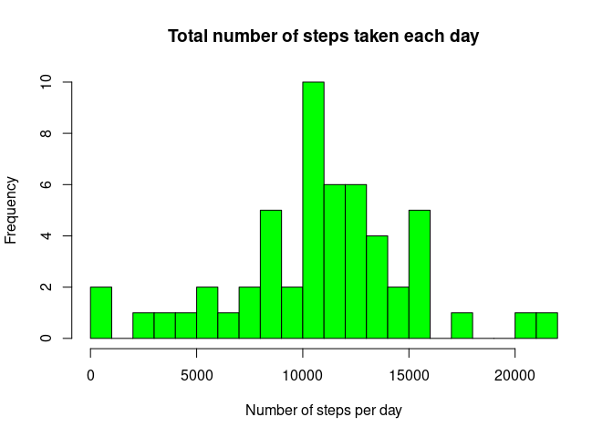
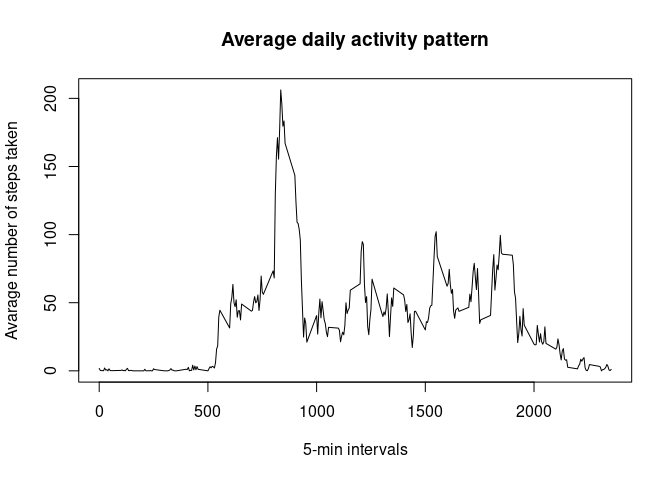
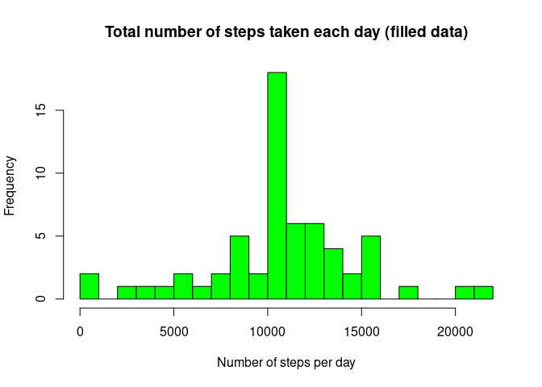

## Introduction


Reproducible Research: Peer Assessment 1

Peer-graded Assignment: Course Project Week 2

The goal of this assignment is to explore the data from a personal activity monitoring device. This device collects data at 5 minute intervals through out the day. The data consists of two months of data from an anonymous individual collected during the months of October and November, 2012 and include the number of steps taken in 5 minute intervals each day.
This assignment consists of the following 5 tasks.

### 1. Loading and pre-processing the data
It is required that data source file is already in a working directory. I check if the source file is unzipped and if it is not - I unzip it and load the data. Then I delete NA observations, since I do not need it for calculations.


```r
if (!file.exists("activity.csv") ) {
        unzip("activity.zip")
}
raw_data <- read.csv("activity.csv", header = TRUE)
main_data <- na.omit(raw_data)
```

Then I explore the data with functions ‘str’, ‘head’, ‘tail’, ‘table’ (for each column) in order to get aquianted with it.

### 2. What is mean total number of steps taken per day?

I calculate the total number of steps taken per day as a data frame with 2 columns: day and sum.


```r
steps_per_day <- aggregate(main_data$steps, by = list(Steps.Date = main_data$date), FUN = "sum")
```

Then I make a histogram with the frequency ot total numbers


```r
hist(steps_per_day$x, col = "green", 
     breaks = 20,
     main = "Total number of steps taken each day",
     xlab = "Number of steps per day")
```

<!-- -->

And I calculate the mean and median of the total number of steps


```r
mean_steps <- mean(steps_per_day[,2])
print (mean_steps)
```

```
## [1] 10766.19
```

[1] 10766.19


```r
median_steps <- median(steps_per_day[,2])
print (median_steps)
```

```
## [1] 10765
```

[1] 10765

### 3. What is the average daily activity pattern?

At first, we can look at the plot of the number of steps taken averaged across all days, along all 5-min intervals


```r
avaraged_day <- aggregate(main_data$steps, 
                          by = list(Interval = main_data$interval), 
                          FUN = "mean")
plot(avaraged_day$Interval, avaraged_day$x, type = "l", 
     main = "Average daily activity pattern", 
     ylab = "Avarage number of steps taken", 
     xlab = "5-min intervals")
```

<!-- -->

Then we define the interval with the maximum number of steps


```r
interval_row <- which.max(avaraged_day$x)
max_interval <- avaraged_day[interval_row,1]
print (max_interval)
```

```
## [1] 835
```

[1] 835

### 4. Imputing missing values
I calculate the total number of NA values in the data set


```r
NA_number <- length(which(is.na(raw_data$steps)))
print (NA_number)
```

```
## [1] 2304
```

[1] 2304
For substituting NA values I use simple ‘impute’ function in ‘Hmisc’ package (it is implied that this package is installed). I create a new dataset with the missing data filled in.


```r
library(Hmisc)
```

```
## Loading required package: lattice
```

```
## Loading required package: survival
```

```
## Loading required package: Formula
```

```
## Loading required package: ggplot2
```

```
## 
## Attaching package: 'Hmisc'
```

```
## The following objects are masked from 'package:base':
## 
##     format.pval, units
```

```r
raw_data_filled <- raw_data
raw_data_filled$steps <- impute(raw_data$steps, fun=mean)
```

Then I make histogram with the new frequencies of total number of steps after imputing.


```r
steps_per_day_noNA <- aggregate(raw_data_filled$steps, 
                                by = list(Steps.Date = raw_data_filled$date), 
                                FUN = "sum")
hist(steps_per_day_noNA$x, col = "green", 
     breaks = 20,
     main = "Total number of steps taken each day (filled data)",
     xlab = "Number of steps per day")
```

<!-- -->

And I calculate the new mean and median of the total number of steps after imputing.


```r
mean_steps_noNA <- mean(steps_per_day_noNA[,2])
print (mean_steps_noNA)
```

```
## [1] 10766.19
```

[1] 10766.19


```r
median_steps_noNA <- median(steps_per_day_noNA[,2])
print (median_steps_noNA)
```

```
## [1] 10766.19
```

[1] 10766.19

As we can see, new figures are almost the same as before filling NA values. The median has changed a bit and became equal to the mean.

### 5. Are there differences in activity patterns between weekdays and weekends?
To answer this question I need to create a new variable in the dataset indicating whether a given date is a weekday or weekend day (Russian language in code is due to the reason that weekday names are presented in the locale in R).


```r
raw_data_filled$date <- as.Date(raw_data_filled$date)
raw_data_filled$weekday <- weekdays(raw_data_filled$date)
raw_data_filled$day_type <- ifelse(raw_data_filled$weekday=="суббота" |
                                           raw_data_filled$weekday=="воскресенье","Weekend","Weekday")
raw_data_filled$day_type <- factor(raw_data_filled$day_type)
```

Finally, I plot the number of steps for all 5-min intervals, averaged across weekdays and weekends separately.
```(r)
day_types_data <- aggregate(steps ~ interval + day_type, data=raw_data_filled, mean)

library(ggplot2)
ggplot(day_types_data, aes(interval, steps)) + 
        geom_line() + 
        facet_grid(day_type ~ .) +
        xlab("5-minute intervals") + 
        ylab("Avarage number of steps taken") +
        ggtitle("Weekdays and weekends activity patterns")
```
As we can see, the number of steps on weekends higher on average during the day, but the peak in the morning is higher on weekdays.
